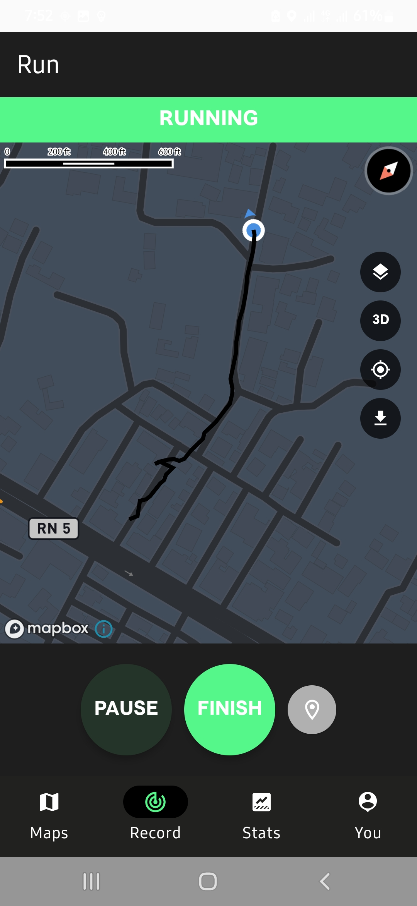
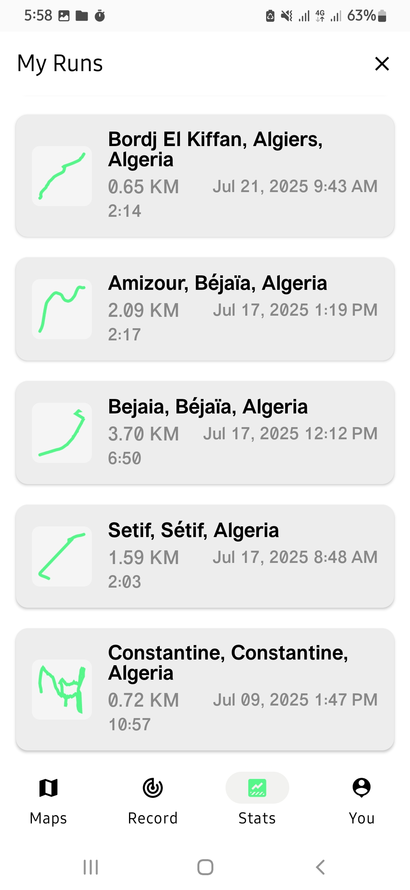
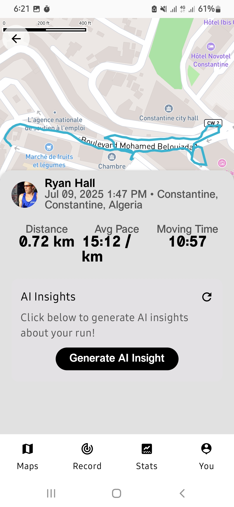

# Athlo
📱 **AI-powered Fitness Companion**

Athlo is a modern, AI-powered Android app designed to help you track, analyze, and improve your active lifestyle. With real-time activity recording, personalized stats, and smart AI-generated insights, Athlo empowers you to reach your fitness goals faster and smarter.

---

## ✨ Features

### ✅ User Authentication: Secure login and signup using email/password.

<div align="center">
  
  
  
  
  
  
  
</div>

---

### 🏠 Home Screen: Personalized dashboard for user overview.

<div align="center">
  
  
</div>

---

### 🗺️ Maps & Route Tracking: Real-time GPS-based activity tracking and route creation.

<div align="center">
  
  
  
  
</div>

---

### 🎽 Activity Recording: Start, pause, and save your runs or activities with intuitive controls.

<div align="center">
  
  
  
  
  
</div>

---

### 📊 Stats & Insights: View detailed statistics and AI-powered insights.

<div align="center">
  
  
  
  
</div>

---

## 🛠️ Installation & Setup

1. **Clone the repo:**
   ```bash
   git clone https://github.com/youcef-boun/Athlo
   ```
2. **Open in Android Studio.**
3. **Enter your own keys 
4. **Sync Gradle and run on an emulator or device.**

---

## 🧩 Technologies Used
- **Kotlin** (Jetpack Compose)
- **AndroidX** (Core, Lifecycle, Activity Compose, Material3)
- **Google Play Services Location**
- **Koin** (Dependency Injection)
- **Supabase** (Authentication/Backend)
- **Mapbox** (Maps & Navigation)
-  **Together AI API** (OpenAI-compatible, for AI-generated insights)
- **JUnit** (Testing)
- **ConstraintLayout Compose**
- **DataStore**

---

## 🤝 Contributing

Contributions are welcome! Please open issues and pull requests for suggestions, bug fixes, or new features.

---

## 📄 License

This project is licensed under the MIT License. See the `LICENSE` file for details.
